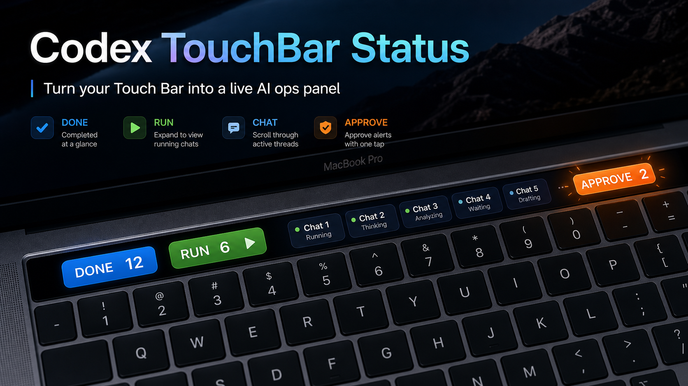

# I Turned a “Dead” MacBook Touch Bar Into a Live AI Ops Panel



Most people wrote off the Touch Bar.

I did too.

Then I noticed something weird in my daily Codex workflow: the biggest time loss was not coding, it was **attention switching**.

Every hour, I kept asking the same questions:

- What is still running?
- What already finished?
- Which thread is blocked and waiting for my approval?

So I built a tiny local system that turns the Touch Bar into a real-time Codex status strip.

## The result

My Touch Bar now acts like a compact control surface:

- `DONE` -> completed tasks today
- `RUN` -> active tasks right now (click to expand)
- `CHAT` -> horizontally scrollable active thread list
- `APPROVE` -> approval-needed alert + confirm action

And one behavior matters most:

When approval is pending, the run area auto-expands and the approve control becomes impossible to ignore.

## Why this works better than a dashboard tab

A dashboard is powerful, but it is not always visible.

The Touch Bar is always in your peripheral vision while you type. That means:

- faster reaction to blocked tasks
- fewer missed approvals
- less mental overhead from context switching

In practice, this changed my workflow from “periodically check status” to “status is ambient by default.”

## Design choices (the high-leverage ones)

I intentionally kept the product opinionated.

### 1) Local-first, no cloud dependency

Status is computed from local Codex state and rendered locally.

### 2) Minimal install friction

- unzip
- run installer
- run one connect command

That is it.

### 3) Action-oriented states, not decorative UI

The system prioritizes decisions:

- continue working
- review running threads
- handle approval immediately

### 4) Expand/collapse is not just visual polish

`RUN` has a disclosure behavior:

- right-pointing triangle when collapsed
- tap to expand thread visibility
- tap again to collapse

When approvals exist, expansion is forced to keep urgent items visible.

## Architecture in one line

```text
Local Codex state -> status collector -> status.json -> Touch Bar scripts -> BetterTouchTool widgets
```

## Core components

- `codex_status_display.py`
  - collects running / completed / awaiting-response signals
  - writes normalized status snapshot
- `touchbar_status_widget.sh`
  - compact widget output for DONE / RUN / CHAT / APPROVE
- `touchbar_approve_action.sh`
  - confirm-first approve action
- `codex-touchbar` CLI
  - connect / status / btt-commands / preview
- installer scripts
  - install / uninstall for quick machine setup

## The “delegate setup” pattern I wanted

I did not only want this for my own machine.

I wanted a flow where I can send a folder to another Mac and say one sentence to Codex:

“Install this fully, connect to my local Codex state, configure Touch Bar widgets, and report final usable results.”

That pattern matters if you maintain multiple Macs or collaborate with others who want reproducible local tooling.

## What I learned building this

1. **Tiny interfaces can have huge operational value.**
2. **Approval signals matter more than raw activity counts.**
3. **Smooth interaction states increase trust** (especially expand/collapse). 
4. **Installation simplicity determines adoption** more than technical sophistication.

## Open source

If you want to use it, fork it, or adapt it for Stream Deck / menu bar / other agent stacks:

https://github.com/Yaobin29/codex-touchbar-status

If you ship a variant, I would love to see it.
